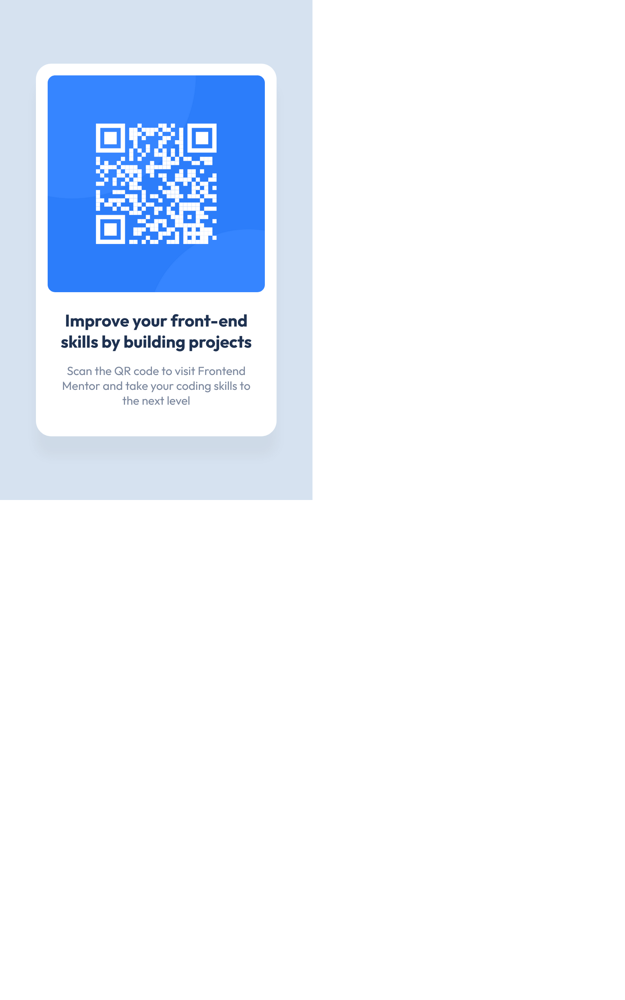

# Frontend Mentor - QR code component solution

This is a solution to the [QR code component challenge on Frontend Mentor](https://www.frontendmentor.io/challenges/qr-code-component-iux_sIO_H). Frontend Mentor challenges help you improve your coding skills by building realistic projects.

## Table of contents

- [Overview](#overview)
  - [Screenshot](#screenshot)
  - [Links](#links)
- [My process](#my-process)
  - [Built with](#built-with)
  - [What I learned](#what-i-learned)

## Overview

### Screenshot

<p float="left">
  
</p>
https://reversalgm.github.io/qr-code-component/

### Links

- Solution URL: [https://www.frontendmentor.io/solutions/flexbox-solution-Dam5IJGRsQ](https://www.frontendmentor.io/solutions/flexbox-solution-Dam5IJGRsQ)
- Live Site URL: [https://reversalgm.github.io/qr-code-component/](https://reversalgm.github.io/qr-code-component/)

## My process

### Built with

- Semantic HTML5 markup
- CSS custom properties
- Flexbox
- Mobile-first workflow

**Note: These are just examples. Delete this note and replace the list above with your own choices**

### What I learned

This was my first project done using pure HTML and CSS. I was able to create the card according to the design but found that it was not responsive.
I restarted from scratch and defined the card using viewport units and used aspect-ratio to maintain the rectangular shape.

```
.card {
  height: 74.5vh;
  aspect-ratio: 1 / 1.55;
}
```

I then continued to use percentage and viewport units to build out the child elements.

.qr-code {
width: 100%;
border-radius: 1.5vh;
}

.title {
font-size: 3.375vh;
margin: 1.25vh 0 0;
}

.subtitle {
font-size: 2.35vh;
margin: 0;
padding: 0 2.25vh;
}

Now everything will scale according to the viewport size, and everything will scale at the same rate maintaing the porportions and the overall look of the design.
